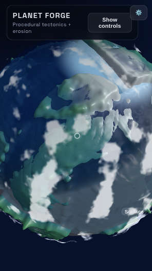
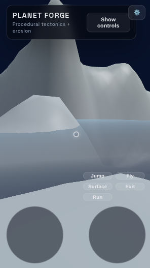
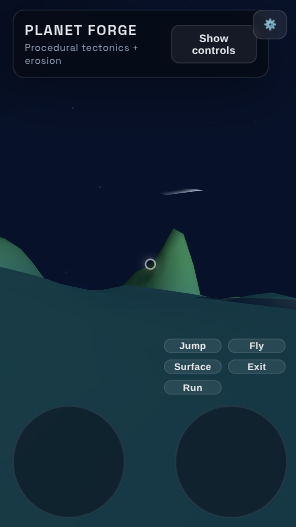

# Worldgen (Planet Gen)

An interactive WebGL planet generator that simulates plate tectonics, hydraulic erosion, and atmospheric/cloud layers. Build and orbit procedural worlds, then drop into a Tiny Planet first-person explorer to walk, swim, or fly across the surface.

## Screenshots
- 
- 
- 

## Features
- **Procedural tectonics**: Plate-based heightfield with adjustable plate count, jitter, fault styles, and height deltas.
- **Hydraulic erosion & hydrology**: Rain/flow simulation, smoothing passes, river/lake masks, and water meshes.
- **Atmosphere & clouds**: Toggleable atmosphere shell plus configurable cloud shader (fbm/billow/cellular), speed, density, height, and multiple layers.
- **Surface explorer**: Tiny Planet first-person mode with walking, running, swimming, flying, jump, and surface snap; orbit view uses Trackball controls.
- **Mobile-friendly controls**: HUD auto-collapses; mobile overlay with twin sticks, action buttons (fly/jump/run/exit/surface) and center reticle. Sensitivities and invert look are configurable via a cog menu.
- **Polar ice**: Water shader blends to ice based on the iceCap setting; ice cap size is adjustable.

## Controls
- **Orbit view**: Drag to rotate, scroll/pinch to zoom, middle-click the planet to enter Tiny mode, Surface button snaps to visible point.
- **Tiny mode (desktop)**: WASD/arrows to move, Space jump, Shift run, Ctrl down, F fly toggle, Q/E roll, Esc exit.
- **Tiny mode (mobile)**: Twin sticks for move/look, buttons for jump/fly/run/exit/surface; reticle shows surface target.

## Config & UI
- HUD sections are collapsible; presets for fast/balanced/high fidelity.
- Config (cog button) for left stick sensitivity, horizontal/vertical look sensitivity, invert look.
- Preset-driven parameters for resolution, plates, erosion, smoothing, sea level, plate deltas, ice caps, atmosphere, clouds, etc.

## Future Plans
- **VR mode**: WebXR entry/exit and controller mappings via the input router.
- **Input router expansion**: unify desktop/mobile/VR inputs, richer mobile visuals, and twin-stick tuning.
- **Swimming polish**: further refine shallow-water handling and orientation resets.
- **Water/ice visuals**: extra polish for polar blending and shoreline detail.

## Getting Started
1. Install dependencies: `npm install`
2. Run dev server: `npm run dev`
3. Open the app in your browser; use presets and controls to generate and explore planets.
